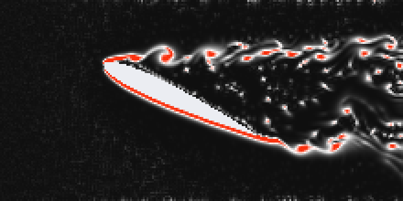

# Turbulence: NACA 0012 at High Angle of Attack (Visual Basic 6)

An educational project in Visual Basic 6.0: an interactive 2D simulation of separated
flow past a symmetric **NACA 0012** airfoil at a high angle of attack (25° by default),
visualizing vorticity magnitude — in the spirit of CFD package screenshots
(DDES / URANS / RANS comparisons).

## Screenshot

## Project Files

| File | Purpose |
|---|---|
| `Turbulence.vbp` | VB6 project file |
| `frmMain.frm` | Main form: rendering (StretchDIBits) and UI controls |
| `modFluid.bas` | Solver: 2D incompressible Navier-Stokes equations |
| `preview.png` | What the simulation roughly looks like (frame from a Python port of the same scheme) |

## Getting Started

1. You need the **Microsoft Visual Basic 6.0** IDE (Windows). The sources are plain
   **ASCII** with CRLF line endings, so they open correctly under any Windows locale.
2. Open `Turbulence.vbp` in VB6 and press **F5**.
3. For maximum speed, build a native EXE: *File → Make Turbulence.exe*
   (on the Compile tab of the project properties you can enable optimizations and
   turn off Array Bounds / Overflow checks — this speeds up the solver considerably).

## Controls

- **Start / Pause** — run and stop the simulation.
- **Reset** — clear the flow field.
- **Angle of attack** (0–40°) — the body mask is rebuilt on the fly.
- **Viscosity** — grid kinematic viscosity (lower = "more turbulent").
- **Flow speed** — freestream velocity.
- **Tracer particles** — green passive particles advected by the velocity field.

The color scale shows vorticity magnitude |curl **V**|: dark background → white → red
(red marks the most intense eddies), like the *Vorticity Magnitude* scale in CFD packages.

## Under the Hood (Numerical Scheme)

The 2D incompressible Navier-Stokes equations are solved with the "stable fluids"
method (J. Stam, 1999):

1. **Semi-Lagrangian advection** — velocity values are traced back along
   trajectories with bilinear interpolation. Unconditionally stable.
2. **Explicit viscous diffusion** (five-point Laplacian).
3. **Vorticity confinement** (Steinhoff/Fedkiw) — feeds back the eddy energy
   dissipated by the numerical diffusion of the semi-Lagrangian scheme; without it
   the wake comes out too smooth.
4. **Pressure projection** — the Poisson equation `lap(p) = div(V)` is solved with
   Gauss-Seidel iterations (24 by default), then the pressure gradient is subtracted
   from the velocity, making the field nearly divergence-free.

The airfoil is defined analytically (the classic NACA 00xx half-thickness formula,
12% thickness) as a mask of solid cells; the body enforces a no-penetration condition.
Domain boundaries: inflow on the left with a small random perturbation (it "ignites"
the shear-layer instability), free outflow on the right, free-slip walls at top and
bottom.

## Relation to DDES / URANS / RANS

- **RANS** — steady-state averaging: all turbulence is "hidden" inside the model,
  the picture shows only a smooth wake.
- **URANS** — unsteady computation: large eddies are visible (separation, a Karman
  street), the small scales are still modeled.
- **DDES/LES** — large eddies are resolved by the grid, only the subgrid scales are
  modeled: the richest picture.

This solver is unsteady and has no explicit turbulence model: large eddies are
resolved directly by the grid, and the numerical dissipation of the scheme plays the
role of a subgrid model (an ILES-style approach). So the picture is closest to the
URANS/DDES panels: you can see leading-edge separation, the shear layer rolling up
into vortices, and an unsteady vortex street behind the airfoil. It is, of course,
a toy model rather than engineering CFD: a 220x110 grid, laminar Reynolds numbers, 2D.

## Tuning

Constants at the top of `frmMain.frm`:

- `GRID_NX`, `GRID_NY` — grid size (bigger = prettier but slower);
- `TIME_SCALE` — how many "physical" seconds are displayed per solver step;
- `NPART` — number of tracer particles.

`Form_Load` sets `NITER` — the number of pressure solver iterations (more = better
incompressibility, slower) — and `epsConf` — the vorticity confinement strength
(0 = off; 0.1 and above makes the wake "boil" harder).

## Limitations

- The project could not be compiled in the actual VB6 IDE here — the code is written
  strictly in VB6 syntax, and the numerical scheme was verified one-to-one with a
  Python port (stability, flow separation, and a vortex street at 25°).
- In the IDE (p-code) the computation is noticeably slower than a compiled native EXE.
- The solver is a 2D toy model for demonstration and learning, not a validated CFD code.

## License

MIT License

Copyright (c) 2026 Mykhailo Makarov

Permission is hereby granted, free of charge, to any person obtaining a copy
of this software and associated documentation files (the "Software"), to deal
in the Software without restriction, including without limitation the rights
to use, copy, modify, merge, publish, distribute, sublicense, and/or sell
copies of the Software, and to permit persons to whom the Software is
furnished to do so, subject to the following conditions:

The above copyright notice and this permission notice shall be included in all
copies or substantial portions of the Software.

THE SOFTWARE IS PROVIDED "AS IS", WITHOUT WARRANTY OF ANY KIND, EXPRESS OR
IMPLIED, INCLUDING BUT NOT LIMITED TO THE WARRANTIES OF MERCHANTABILITY,
FITNESS FOR A PARTICULAR PURPOSE AND NONINFRINGEMENT. IN NO EVENT SHALL THE
AUTHORS OR COPYRIGHT HOLDERS BE LIABLE FOR ANY CLAIM, DAMAGES OR OTHER
LIABILITY, WHETHER IN AN ACTION OF CONTRACT, TORT OR OTHERWISE, ARISING FROM,
OUT OF OR IN CONNECTION WITH THE SOFTWARE OR THE USE OR OTHER DEALINGS IN THE
SOFTWARE.

## Support

If you found this project interesting or useful, you can support my work:

